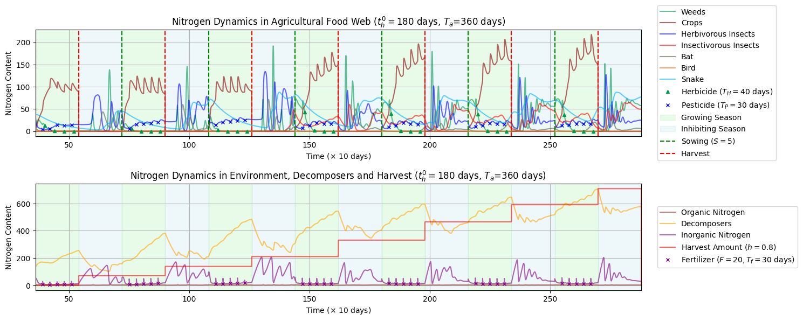

# 从森林到农场：可持续农业中的氮动力学建模

<div align="center">
<p>
    
    
    
</p>
</div>
<div align="left">

Available in: **[English Version](./README.md)** 

</div>

> 🏆 特等奖提名奖 (Finalist Award | 全球27,456支队伍中排名前1.8%)
> -  本仓库包含了我们为 **[2025年MCM/ICM竞赛E题](https://www.contest.comap.com/undergraduate/contests/mcm/contests/2025/problems/2025_ICM_Problem_E.pdf)** 提交的完整解决方案。
> -  我们采用基于改进Lotka-Volterra方程的动态建模方法，模拟了森林与农业生态系统中的氮循环过程，并深入分析了从森林到可持续性农田的生态系统转变。
> -  本项目中包含了论文的**tex源文档**以及**所有代码**。
> -  对于我们论文思路，以及正文讲解，请见 **[本人博客文章](https://www.cnblogs.com/JQ-Luke/p/18858431)**。
> - 推荐阅读顺序：
>   1. 阅读[模型一的jupyter笔记本](./notebooks/1_model_1.ipynb)，包含我对欧拉法与微分方程模型的理解，如何调参，以及相应的求解代码；
>   2. 阅读[中文博客](https://www.cnblogs.com/JQ-Luke/p/18858431)中的思路讲解，我们建立模型解决问题的过程，强烈建议在读之前 **[先读一遍赛题](https://www.contest.comap.com/undergraduate/contests/mcm/contests/2025/problems/2025_ICM_Problem_E.pdf)**，先理解问题能够更容易读懂我们解决问题的思路；
>   3. 阅读我们的英文版参赛论文和后续代码（尽信书不如无书，希望大家对我们论文**批判性阅读**，取长补短，在博客里赛后复盘我其实感觉我们有很多点没做好，希望后来者能够吸取我们的经验教训做得更好）；
>   4. 拓展阅读，读完我们文章之后建议再去找一下本题的o奖论文，横向对比一下其他人的解决方案。以及往年的微分方程题目（通常是A题）相应的o奖论文，从而以本项目为起点学会微分方程这一类问题的解决方法。
> - **本项目内容仍在不定期更新中**，建议时不时来看看有没有新内容。此外有任何改进的意见（或是错误）欢迎在本项目中提issue，让我们一起让这个项目变好吧！
> - 🤝 **资源推荐**：文末推荐了其他优秀的开源项目（如集成了 LaTeX 模板及 AI 辅助资源的工具库），欢迎点击跳转至 **[友情链接与美赛资源推荐](#-友情链接与美赛资源推荐)**。
---

## 📖 摘要与解题思路

将森林转变为农田会极大地改变生态系统的结构与功能。本研究聚焦于**氮循环**，采用动态建模方法模拟了从原始森林到现代农场的演变过程。

下图展示了我们论文的**整体工作流程与核心逻辑**，这是我们建立三个递进模型的基础：

<div align="center">
  
  <p><em>图1：本研究的整体工作流程与逻辑框架。</em></p>
</div>

---

## 🔬 核心模型图解

本研究基于三个递进的模型构建，以下是我们如何将生态问题转化为数学模型的示意图。

### 模型一：森林生态系统 (FENCM)
我们首先建立了一个理想化的自然循环模型。如下图所示，氮元素在生产者、消费者和分解者之间流动。我们使用改进的 Lotka-Volterra 方程组来描述这一非线性的动态过程。

<div align="center">
  
  <p><em>图2：自然森林生态系统内的氮通量动态示意。</em></p>
</div>

### 模型二：农业生态系统 (AENCM)
在转变为农田后，**人类活动**成为了主导因素。我们引入了“农业周期”的概念（如下图），将播种、收割、施肥和农药喷洒建模为脉冲函数或周期性参数，重点分析了作物与杂草的竞争关系。

<div align="center">
  
  <p><em>图3：模拟的农业周期各阶段及其对氮输入输出的影响。</em></p>
</div>

### 模型三：食物网与生物防治 (AE-FW-NCM)
为了模拟更真实的生态恢复，我们将简单的食物链扩展为复杂的**食物网**（包含蝙蝠、昆虫、蛇等7个物种）。并通过仿真分析了使用化学农药与采用生物防治（如引入蝙蝠）对生态稳定性的不同影响。

<div align="center">
  
  <p><em>图4：包含生物防治机制的复杂农业食物网结构。</em></p>
</div>

### 📊 仿真结果示例
这是我们模型三在引入化学制剂（除草剂+杀虫剂）情况下的部分仿真结果。可以看到各物种数量（以氮含量表示）随季节和农业周期的剧烈波动：

<div align="center">
  
  <p><em>图5：引入化学制剂后的农业生态系统动态仿真结果。</em></p>
</div>

> *更多详细的灵敏度分析和无化学制剂的对比结果，请参阅我们的论文正文。*

---

## 📁 仓库结构

为了确保清晰性和可复现性，本仓库按以下结构组织：

```plaintext
MCM-ICM-2025-E-Nitrogen-Cycling-Model/
│
├── .gitignore               # Git忽略配置文件
├── LICENSE                  # MIT许可证文件
├── README.md                # 本文档的英文版
├── README_zh.md             # 本文档（中文版）
├── requirements.txt         # Python项目依赖列表
│
├── notebooks/               # 存放所有的代码与可视化结果
│   ├── 1_model_1.ipynb      # 模型一求解代码，以及我对于微分方程的讲解
│   ├── 2_model_2.ipynb      # 模型二 (AENCM) 求解代码
│   ├── 3_model_3.ipynb      # 模型三 (AE-FW-NCM) 求解代码
│   └── 4_sensitivity_anlysis.ipynb # 灵敏度分析求解代码
│
└── paper/                   # 存放完整的学术论文
    ├── main.tex             # LaTeX源文件
    ├── references.bib       # 参考文献
    ├── figures/             # 图片
    └── 2515324.pdf          # 最终的PDF版本论文
```

## 🚀 开始使用

本项目依赖 **Python** (用于数据分析和模型求解) 和 **LaTeX** (用于论文排版)。为了帮助你顺利运行本项目，我们提供了以下三种配置方法，请根据你的熟悉程度选择（**如遇到任何问题，建议复制本文件所有内容，在大模型的指导下进行**）：

**环境要求:**
* **Python:** 建议使用 Python 3.8 或更高版本。
* **Pip:** Python 的包管理器，通常随 Python 一起安装。
* **代码编辑器:** 推荐使用 [VS Code](https://code.visualstudio.com/)，并安装 [Python](https://marketplace.visualstudio.com/items?itemName=ms-python.python) 和 [Jupyter](https://marketplace.visualstudio.com/items?itemName=ms-toolsai.jupyter) 扩展。

---

### 开始方法一（云端运行：使用 GitHub Codespaces）

这是对于新手**最推荐**的方式。它不需要你在本地安装任何软件（Python, Git, VS Code 都不需要），一切都在你的浏览器中完成，并且能保持最新。

> *优点：无需本地配置，环境纯净，可随时随地跨设备访问。如果你 Fork 了项目，你所做的任何修改都会保存在你自己的仓库中。*

1.  **注册 GitHub 账户**
    如果你还没有 GitHub 账户，请先注册一个。

2.  **(可选，但推荐) Fork 本项目**
    * 在项目主页右上角，点击 **`Fork`** 按钮。
    * 这会把本仓库复制一份到你自己的 GitHub 账户下。这样做的好处是，你可以在你自己的版本上自由修改、运行和保存代码，而不用担心“弄乱”原项目。

3.  **启动 Codespace**
    * 在你 **Fork 后的仓库**（或原仓库）页面，点击绿色的 **`<> Code`** 按钮。
    * 切换到 **`Codespaces`** 标签页。
    * 点击 **`Create codespace on main`** (或你 Fork 后的分支名)。

4.  **等待环境配置**
    * 请耐心等待 1-2 分钟。GitHub 会在云端为你创建一个虚拟电脑，并自动执行安装依赖、配置环境等所有步骤。
    * *注：GitHub 提供免费的 Codespaces 使用额度，通常足够用于课程学习和项目探索。*

5.  **开始使用！**
    * 配置完成后，你的浏览器会打开一个完整的“在线 VS Code”界面。
    * 所有文件和依赖都已准备就绪。你只需在左侧文件浏览器中进入 `notebooks/` 目录，打开 `1_model_1.ipynb` 即可开始运行和学习。

---

### 开始方法二（最简单：下载 ZIP 压缩包）

如果你只想快速查看一下代码和论文，这是一个最直接且**最简单**的方法。
> *注：这种方法非常简单，但缺点是无法通过 `git pull` 快速获取项目更新。如果项目有重要更新（~~虽然本项目大概率不会有~~），你需要重新下载 ZIP 包。*

1.  **下载压缩包**
    在项目的 GitHub 主页 (即一开始英文版 [README.md](https://github.com/LUKEQ420/MCM-ICM-2025-E-Nitrogen-Cycling-Model) 所在的页面)，点击右上角绿色的 **`<> Code`** 按钮，然后点击 **`Download ZIP`**。

2.  **解压文件**
    将下载的 `MCM-ICM-2025-E-Nitrogen-Cycling-Model-main.zip` 文件解压到你希望存放项目的文件夹。

3.  **安装 VS Code (如果尚未安装)**
    [下载并安装 VS Code](https://code.visualstudio.com/)。它是一个功能强大的免费代码编辑器。

4.  **在 VS Code 中打开项目**
    启动 VS Code，点击左上角“文件 (File)” > “打开文件夹 (Open Folder)”，然后选择你刚才**解压后的文件夹**。

5.  **安装推荐的扩展**
    打开文件夹后，VS Code 可能会在右下角弹窗，推荐你本项目所需的扩展。请务必安装 **Python** 和 **Jupyter** 这两个扩展（均由 Microsoft 发布）。

6.  **安装 Python 依赖库**
    * 在 VS Code 中，打开一个新终端 (点击顶部菜单“终端 (Terminal)” > “新建终端 (New Terminal)”)。
    * **建议：** 同样如“方法二”的第4步，在终端中创建并激活一个虚拟环境。
    * 在（已激活虚拟环境的）终端中，运行 `pip install -r requirements.txt` 来安装依赖。

7.  **运行 Notebook**
    在 VS Code 左侧的文件浏览器中，进入 `notebooks/` 目录，点击 `1_model_1.ipynb`。VS Code 将在编辑器窗口中打开它，你可以直接在 VS Code 中运行和修改代码。

8.  **查看论文**
    * **(在线编译) 使用 Overleaf：** 如果你想在线查看或修改 `.tex` 源文件，这是一个很好的免安装选项：
        1.  将你解压项目中的 `paper/` 文件夹单独压缩成一个 `.zip` 文件 (例如 `paper.zip`)。
        2.  访问 [Overleaf (www.overleaf.com)](https://www.overleaf.com/) 并注册一个免费账户。
        3.  在 Overleaf 项目面板，点击 "New Project" (新建项目)，然后选择 "Upload Project" (上传项目)。
        4.  上传你刚刚创建的 `paper.zip` 文件。Overleaf 会自动打开项目，你可以在线编译和查看 PDF。
    * **(本地编译) 使用 VS Code：** 如果你想在本地编译 `.tex` 论文源文件，你需要：
        1.  安装一个 LaTeX 发行版（例如 [TeX Live](https://www.tug.org/texlive/) 或 [MiKTeX](https://miktex.org/)）。
        2.  在 VS Code 中安装 [LaTeX Workshop](https://marketplace.visualstudio.com/items?itemName=James-Yu.latex-workshop) 扩展。

## 🔗 友情链接与美赛资源推荐

为了促进学术交流与资源共享，我们会在此处**持续收录**来自社区的其他优质开源项目。以下是目前为美赛（MCM/ICM）备战**特别推荐**的友链项目：

* **[LaTeX-in-ICM-MCM](https://github.com/QTH1225/LaTeX-in-ICM-MCM)**
    * **项目简介**：这是一个由 [@QTH1225](https://github.com/QTH1225) 整理的、专为美赛设计的 $\LaTeX$ 模板库。该项目不仅提供了开箱即用的论文/海报模板，作者还在其 README 中汇总了大量实用的建模资源（涵盖绘图工具、数据查找源、AI 辅助工具等）。
    * **推荐理由**：如果你需要一个规范的写作环境，或者想寻找一份详尽的“美赛工具箱”，非常推荐关注这个仓库。

> 🤝 **欢迎互链**：
> 本列表**长期开放更新**！如果你也有关于 **美赛/数学建模** 的优质开源项目（无论是优秀论文代码、通用模板、还是资源合集），欢迎通过 **Issue** 联系我或直接提交 **Pull Request** 进行友情链接互挂。让我们共同丰富开源社区，帮助更多的建模学子！

## ⚖️ 许可证
本项目采用 **MIT 许可证** 发行。不介意商业用途，但请注明来源。更多详情请参见 `LICENSE` 文件。
